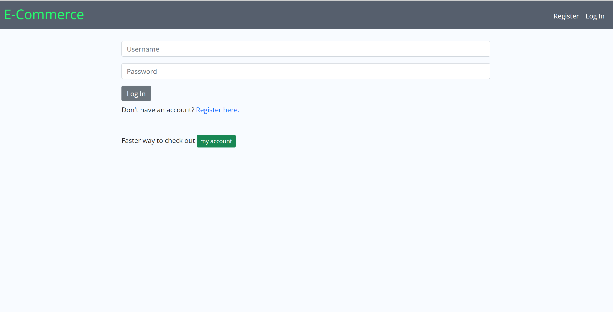
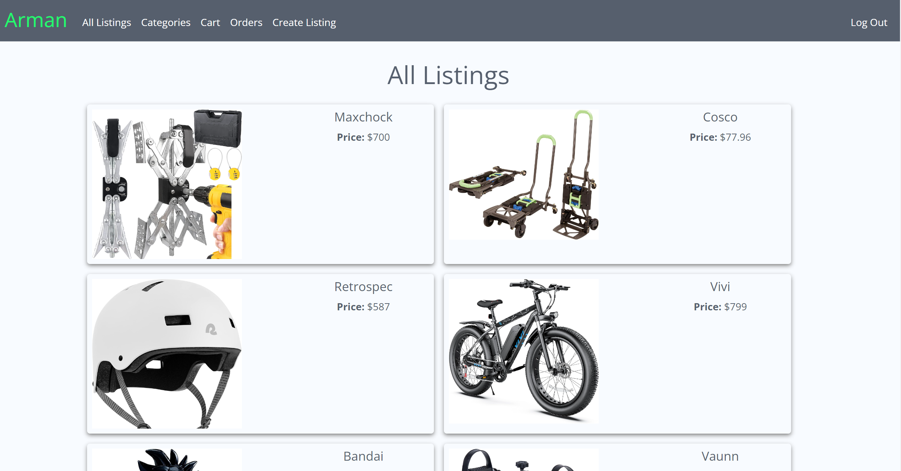
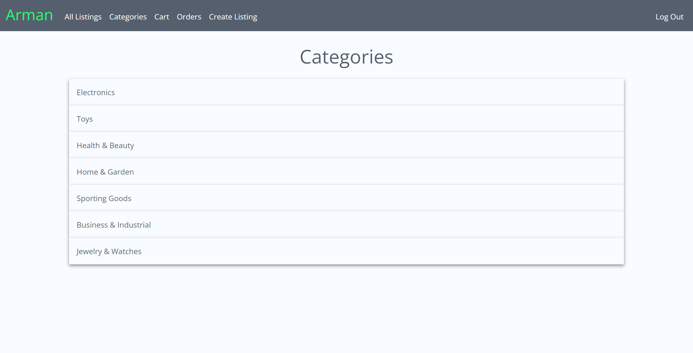
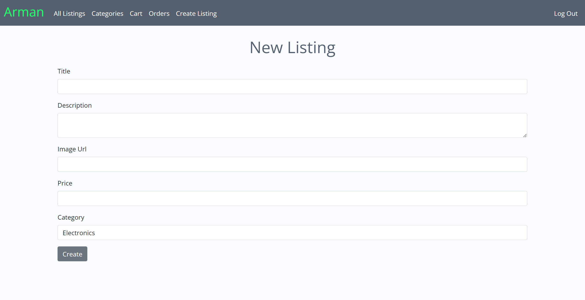

# E Commerce

## Description
This is an e-commerce website where the user can create, add to cart, delete if authenticated, or buy a product.

## Technologies Used
- HTML
- CSS
- Bootstrap
- JavaScript (ES6)
- Flask
- SQLite 

## Usage
Login to the users account using the login form. Register an account using the register form. Go to my account using the 'My Account' button for browsing the website. Use the navbar buttons to navigate between the pages.

### Go to [E-Commerce](https://flask-app-3cw8.onrender.com/)

Login Register

Home page

Listing details

Categories

New listing

## Questions
### Use the links below if you have any questions.
- Email Address - [armanbarseghyan83@gmail.com](mailto:armanbarseghyan83@gmail.com)
- Linkedin - [https://www.linkedin.com/in/arman-barseghyan](https://www.linkedin.com/in/arman-barseghyan)
- GitHub Profile - [https://github.com/ArmanBarseghyan83](https://github.com/ArmanBarseghyan83)